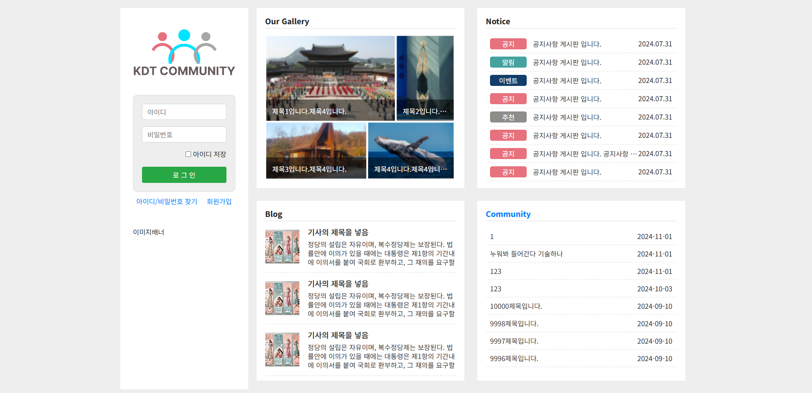
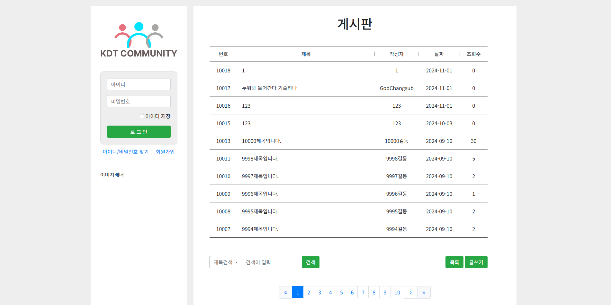
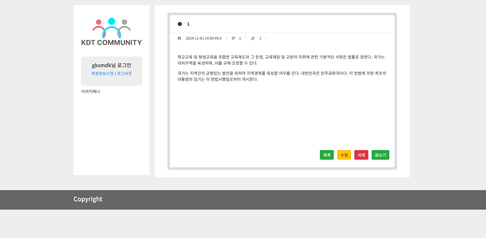
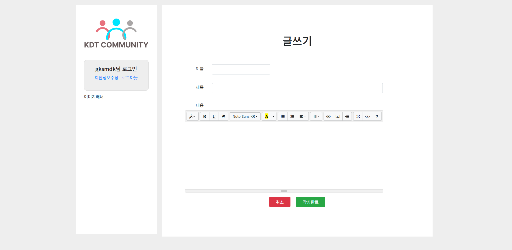
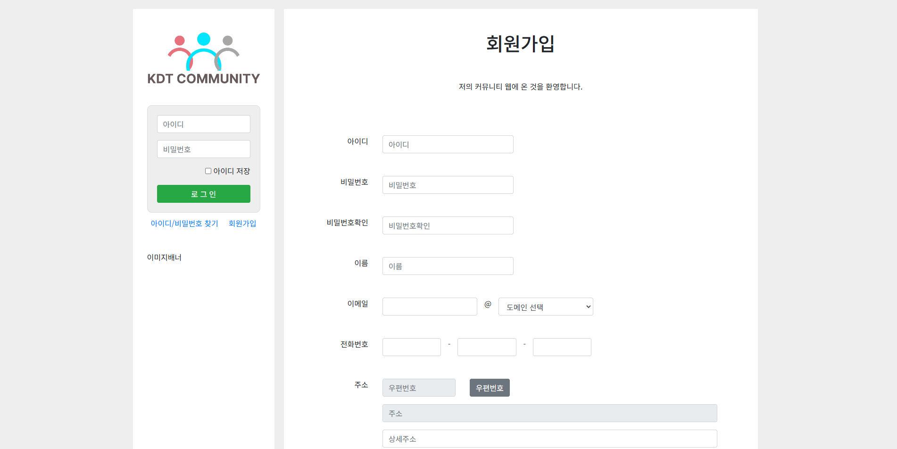
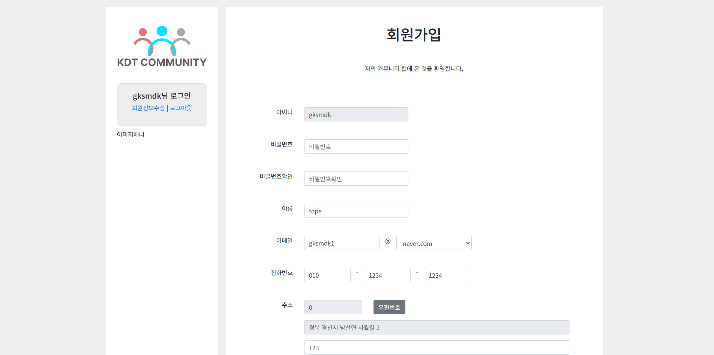
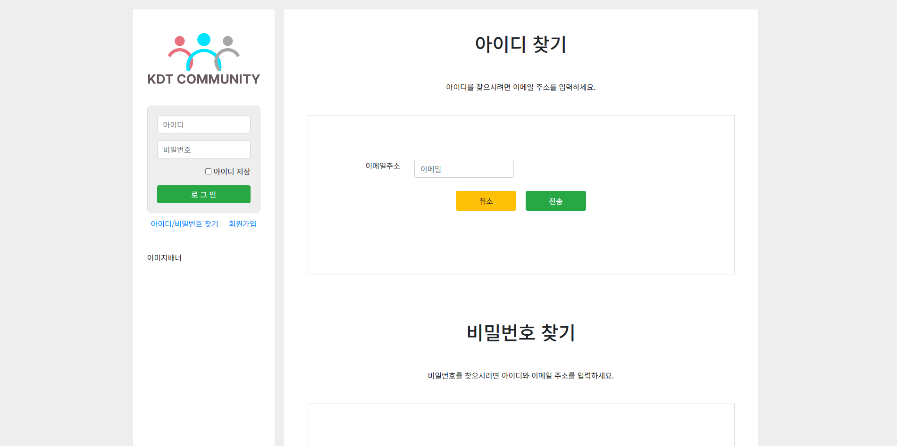

# 📝 KDTWeb Project

## 1. 📖 프로젝트 개요

- **목적**: Java Servlet과 JSP를 활용한 웹 애플리케이션 개발 및 포트폴리오 활용
- **주요 기능**:
  - 사용자 인증 (회원가입, 로그인)
  - 게시판 CRUD 기능
  - 검색 및 필터링 기능
  - 반응형 디자인 지원

---

## 2. 🔧 기술 스택

### 🛠 개발 도구

- **IDE**:

- **버전 관리**:

### 🎨 프론트엔드

### 🔙 백엔드

### 🗄 데이터베이스

---

## 3. 📜 주요 기능

### 사용자 기능

- 🔑 **회원가입 및 로그인**
  - 사용자 정보 저장 및 인증
- 🖊 **게시판**
  - 게시글 작성, 수정, 삭제, 검색 기능
- 📱 **반응형 디자인**
  - 모바일, 태블릿, PC 환경에 최적화된 UI

### 관리자 기능

- ✍️ **사용자 관리**
  - 사용자 조회 및 삭제 기능
- 📊 **데이터 통계**
  - 게시판 및 사용자 활동 통계

---

## 4. 🖼️ 화면 예시

| 화면 설명      | 이미지                             |
| ------------- | --------------------------------- |
| **메인 페이지** |  |
| **게시판 페이지** |  |
| **게시물 페이지** |  |
| **글쓰기 페이지** |  |
| **회원가입 페이지** |  |
| **회원정보 수정 페이지** |  |
| **아이디/비밀번호 찾기 페이지** |  |

---

## 5. 📐 아키텍처

- **MVC 패턴**: Servlet, JSP, JSTL을 이용한 계층 구조 설계
- **MySQL 데이터베이스**: 정규화 및 관계형 데이터 관리

---

## 6. 📊 ERD

| ERD | 이미지 |
| --- | ------ |
| ERD |  |

---

## 7. 📅 프로젝트 일정 <!-- 임시 작성, 수정 필요 -->

| 주차  | 작업 내용                     |
| ----- | --------------------------- |
| 1주차 | 프로젝트 설계 및 환경 설정   |
| 2주차 | 사용자 인증 및 게시판 CRUD   |
| 3주차 | 파일 업로드 및 다운로드      |
| 4주차 | 테스트 및 최적화            |

---

## 8. ⚙️ 설치 및 실행

### 서버 설정

1. Tomcat 서버 설치:
   - [Tomcat 공식 사이트](https://tomcat.apache.org/)에서 다운로드 후 설치
2. 프로젝트를 Tomcat 서버에 배포:
   - WAR 파일 생성 후 `webapps` 폴더에 복사

### 데이터베이스

1. MySQL에 `mysql.sql` 파일을 실행하여 데이터베이스를 초기화합니다.

---

## 9. 🤝 협업 도구

- GitHub를 활용한 버전 관리 및 코드 리뷰
- Postman으로 API 테스트

## 10. 📌 참고 자료

- Java Servlet 공식 문서: https://docs.oracle.com/javaee/7/tutorial/servlets.htm
- MySQL 공식 문서: https://dev.mysql.com/
- Tomcat 공식 문서: https://tomcat.apache.org/
